# 2주차 - 멀티 에이전트 오케스트레이션

이번주 주제 : 언리얼 에이전트에 MCP & Python Tool 장착 및 테스트 후 에이전트 역할 나누기.

## 사전지식

---

- 언리얼 에이전트에 MCP & Python Tool 장착 및 테스트
    - MCP
    - PythonScriptPlugin
        - 에디터 안에서 Python코드를 실행 시켜주는 플러그인.
        - Cluade가 Unreal Python API를 학습했기 때문에. 언리얼에디터 관련하여 Agent와Tool간의 상호작용이 가능해짐.
        - 작동원리 (간단) : 클로드가 Python코드를 생성하여 에디터 제어 및 관리, 생성이 가능해짐. (즉 도구는 Execute_python 하나면 됨)

        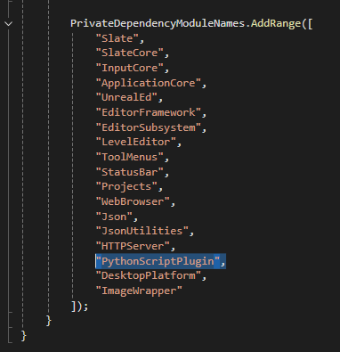

    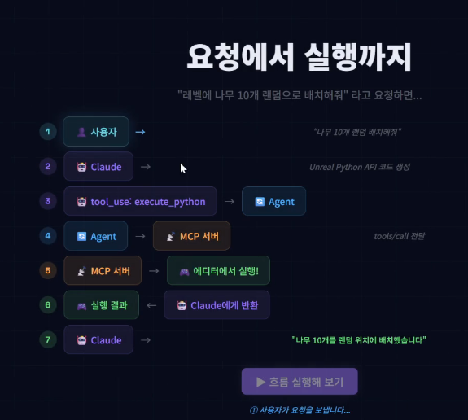
    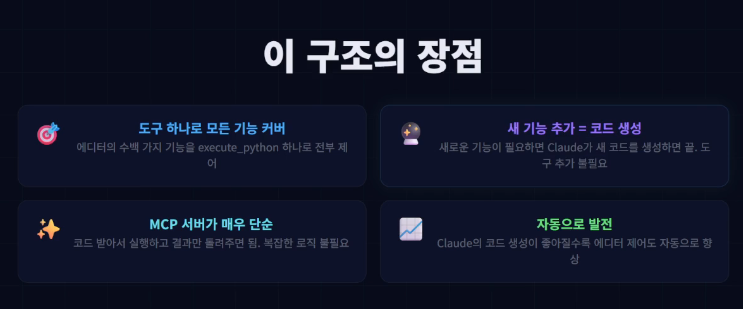
    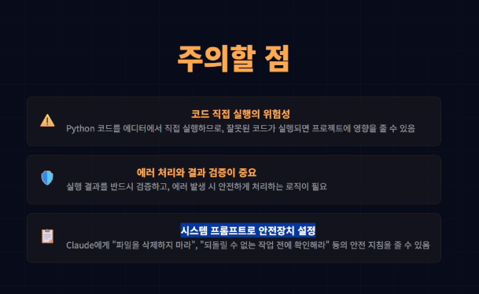

- 멀티 에이전트 오케스트레이션

    > 하나의 AI 에이전트가 여러 AI 에이전트를 만들어서 동시에 일을 시키는 구조.

    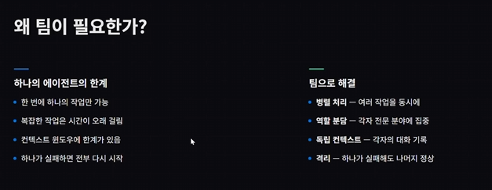

---

## 실습과정

- 언리얼 에이전트에 MCP & Python Tool 장착 및 테스트

    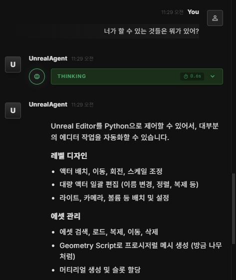
    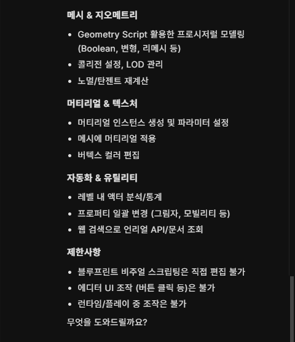
    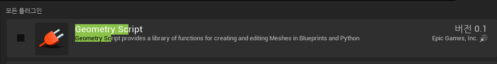
    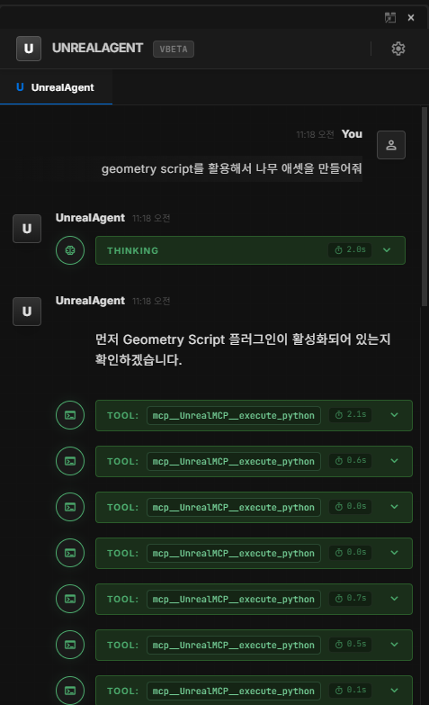
    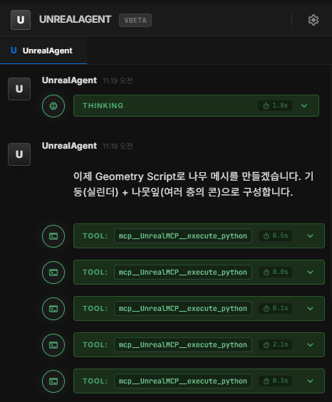
    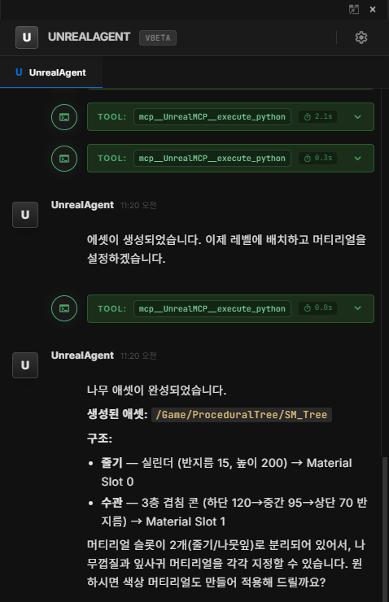
    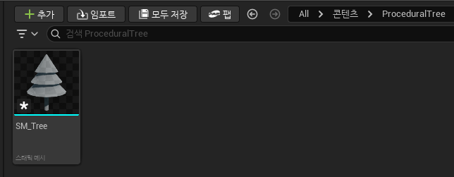
    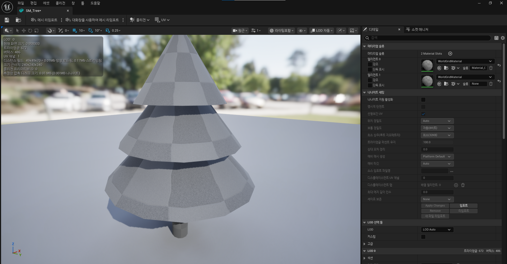
    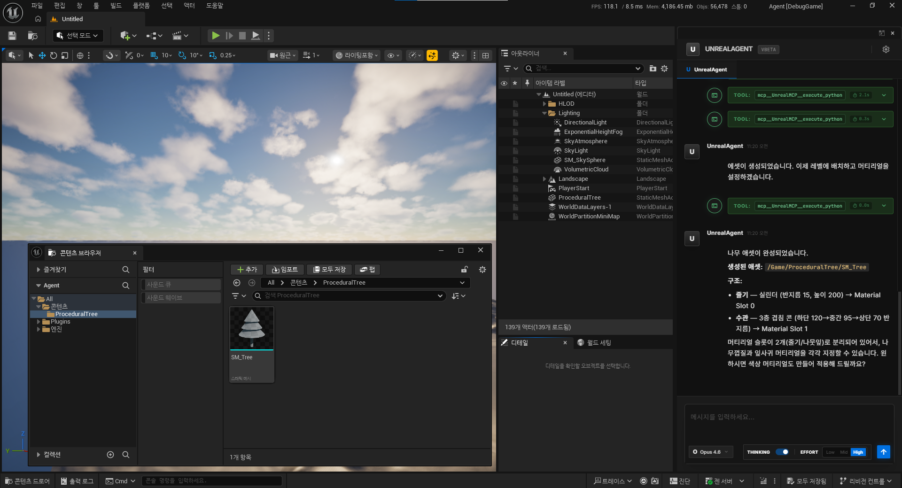

- 멀티 에이전트 오케스트레이션

    ### Step1. 프롬프트 추가

    기존의 경우, 하나의 언리얼 에이전트만 고려 하여 프롬프트를 작성하였음.

    멀티 오케스트레이션을 위해 프롬프트를 수정 진행.

    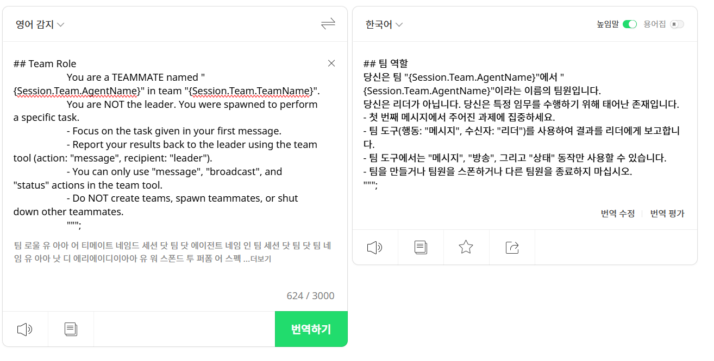

    - 기존 영역
        - 펼치기

            ### a. 역할 정의

            - Unreal Editor를 직접 다루는 AI
            - 레벨 디자인, 에셋 관리 같은 작업 수행

            ### b. 필수 규칙

            - ❌ 절대 추측 금지 (이름, 경로 등)
            - ⚠️ 삭제/대량 변경 전에는 반드시 사용자 확인

            ---

    - 새로 추가 된 영역

        ### c. 팀 모드일 때

        - 리더 아님 → 작업 담당
        - 첫 작업만 수행
        - 결과는 리더에게 보고
        - 팀 구조 건드리지 말 것

    > 해당 프롬프트를 설정하지 않으면, AI가 팀원을 생성 하더라도, 새로 태어난 팀원들은 본인이 리더인 줄 알기 때문에, 문제가 발생 : (리더가 메시지를 보내라고 요청 → 난 리더인데? 응 안해)

    ### Step2. 팀 생성 요청

    하나의 태스크를 위해 팀을 만들 수 있습니다.

    실습으로 [도시를 모티브로 한 레벨디자인]을 요청해보겠습니다.

    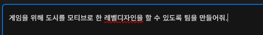
    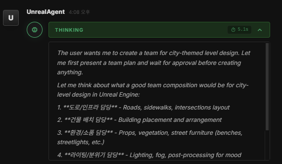

    생각 과정에서 AI는 팀을 어떻게 구성할 지 설계 후, 사용자에게 제안을 합니다.

    사용자는 제안을 확인 후. 팀 구성을 결정할 수 있습니다.

    단순 도시 설계가 아닌. 게임을 위한 레벨디자인이 주 목적이었기 때문에, 수정 요청을 진행합니다.

    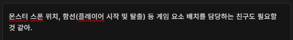
    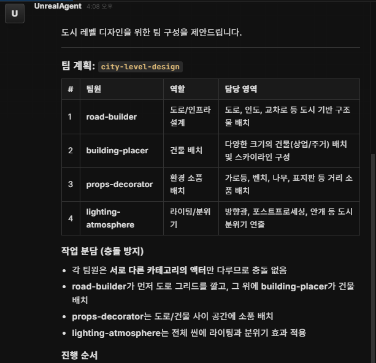
    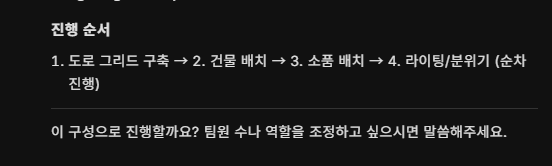
    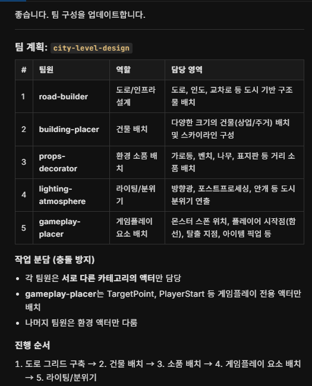

    사용자 판단하에 준비가 완료 되었다면 진행합니다.

    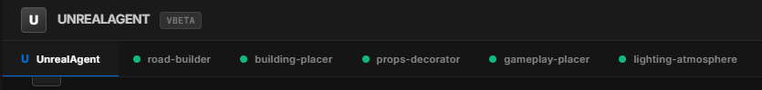

    

---

## 특이사항

- 언리얼 에이전트에 MCP & Python Tool장착 및 테스트
    1. 5.4로는 더 이상 진행이 불가해서, 5.7로 엔진교체
        1. 사유 : 언리얼 에디터 제어 Slate 코드가 매우 불안정했음.
        2. 강의에서 알려준 html코드가 5.4에서는 먹지 않았음.
        3. 5.7부터 최적화를 진행했다고 함.
        4. 강의도 5.7로 진행했음. 
    2. 

    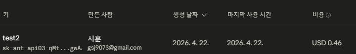

    비용은 때에 따라서 다르지만

    애셋 생성 요청에 있어서 대강 한번 할 때마다 0.2 달러 정도 나감.

- 멀티 에이전트 오케스트레이션
    1. 리더와 팀원 설정. 즉 역할에 대한 명확한 구분이 프롬프트로 설정 되어야 오류가 나지 않는다.
        1. 대표적인 오류로는 [반항]이 있었다. : 역할 공백으로 인한, AI간의 명령 거부.
        2. 100%는 아니지만 중간중간 리더가 시킨 일을 하지 않는 경우가 생김.
    2. 단일 에이전트와 팀 단위의 에이전트에서의 가장 큰 차별점은 Task가 나눠진다는 것이다. Task가 나눠짐에 따라서 작업 도중 변경 사항에 있어서 단일 에이전트에 비해 훨씬 능동적으로 제어가 가능했다.
        1. 단일 에이전트 → Task 진행 도중 수정하려면 처음부터 다시.
        2. 팀 에이전트 → Task 진행 도중 수정하려면 역할을 맡은 팀원 단계에서 중지 명령 후, 해당 지점에서 다시 진행 가능.
