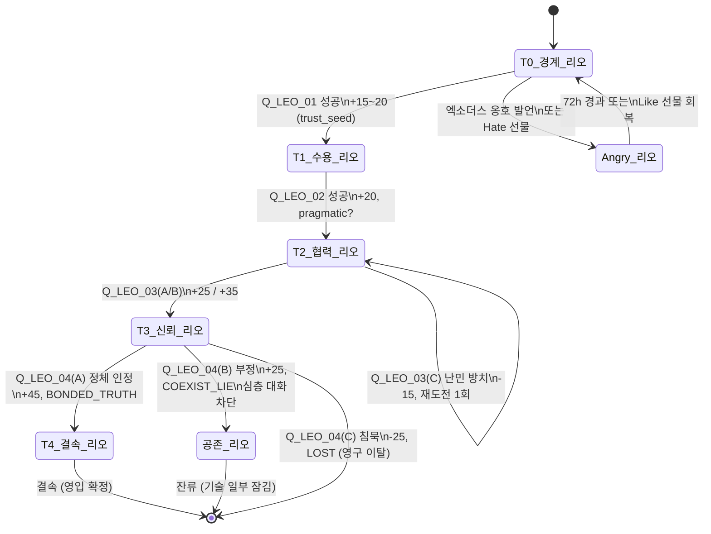
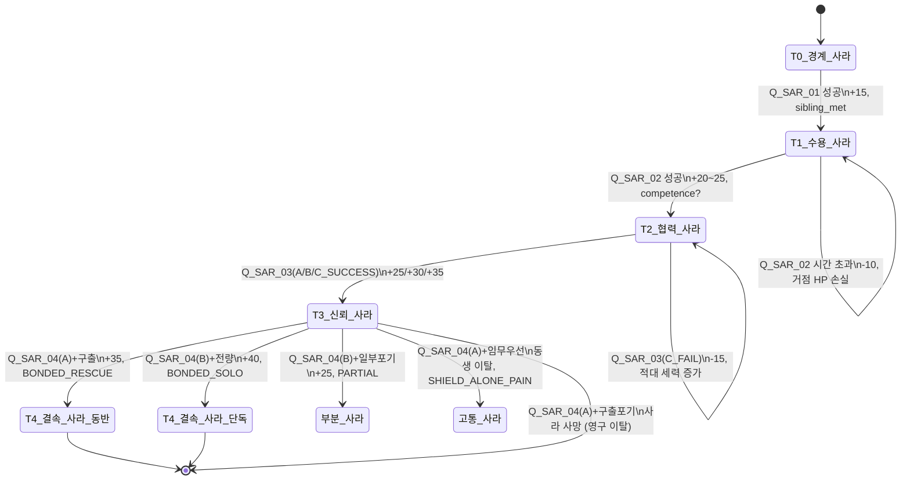
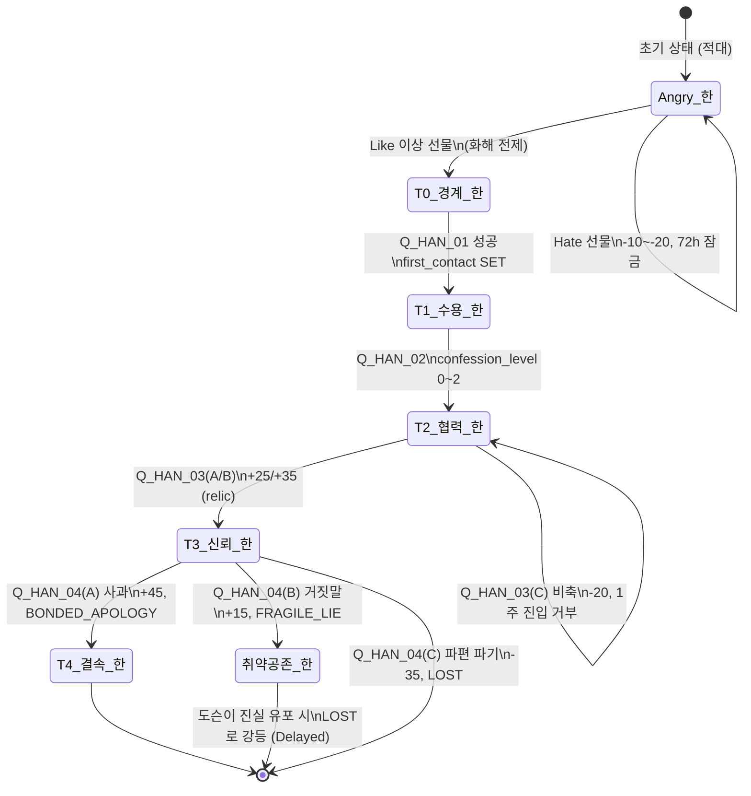
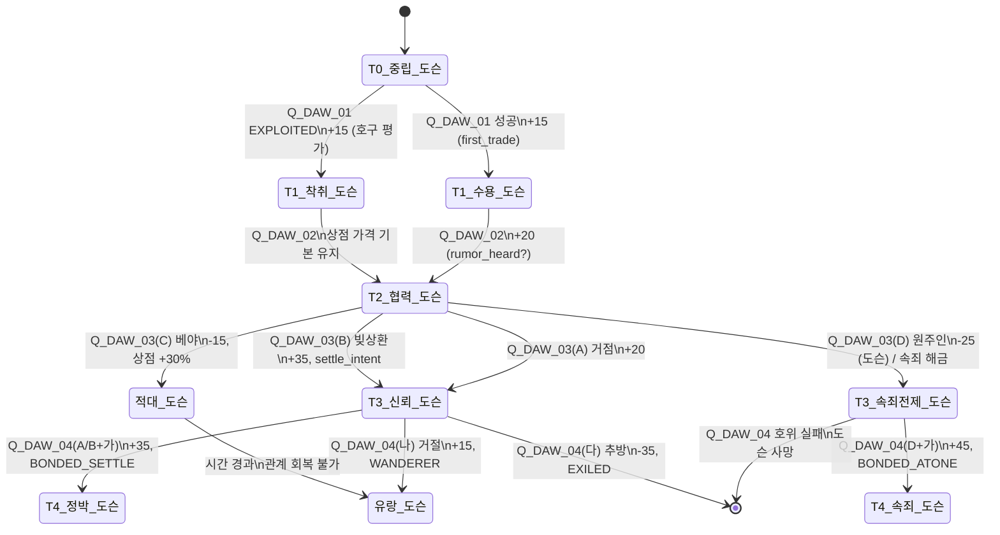
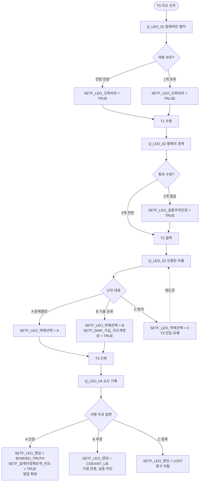
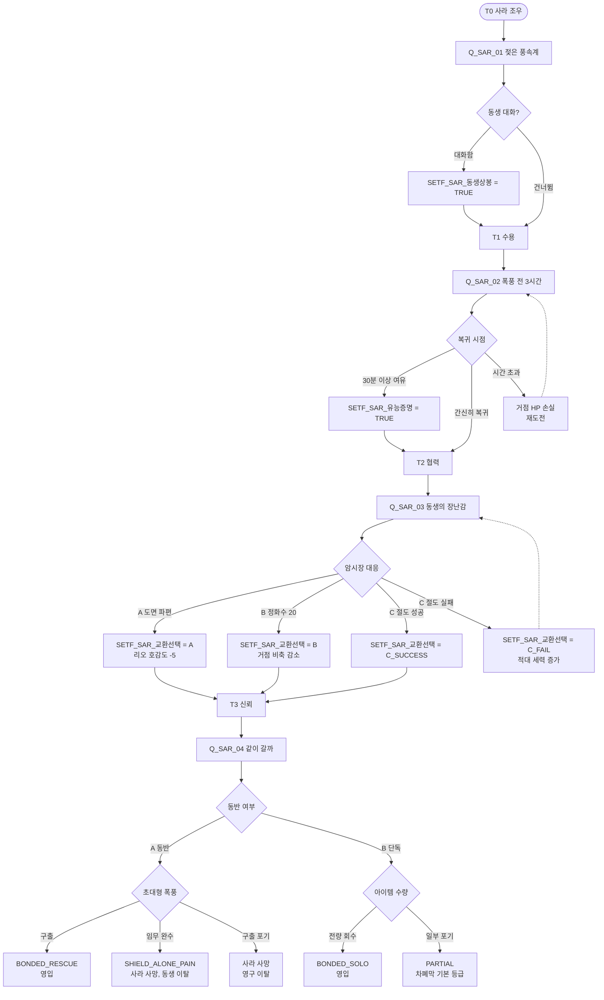
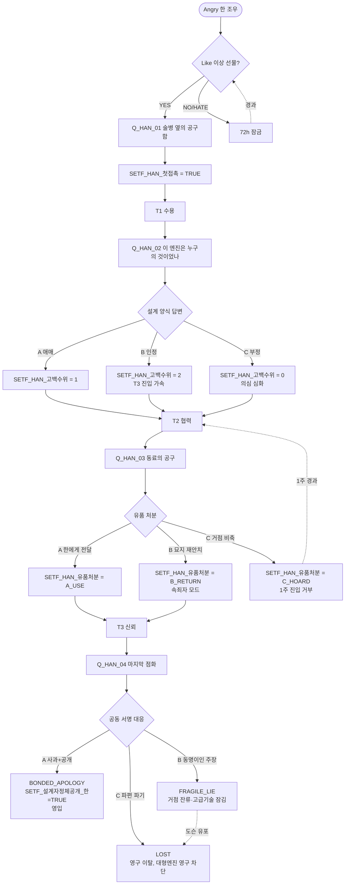
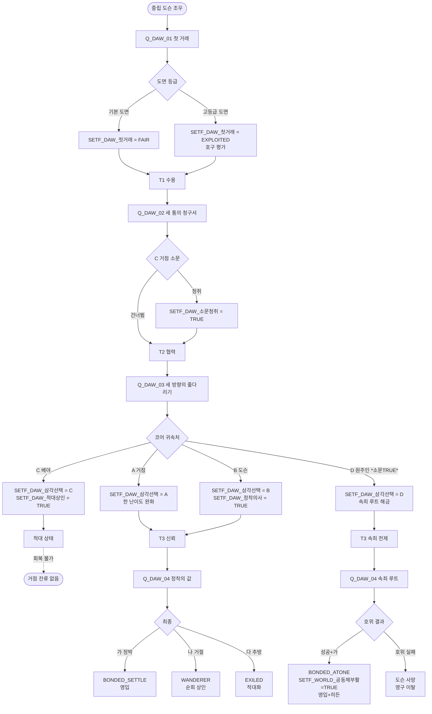

# 04. 분기 구조도

## 1. 설계 원칙 (분기 패턴 혼합 방침)

Project PA의 4-NPC 영입 내러티브는 **"공동체의 규모가 곧 생존의 확률"** 이라는 핵심 테마를 구조적으로 강제한다. 따라서 분기 설계는 단일 패턴에 의존하지 않고 티어별·NPC별로 상이한 패턴을 배합한다. T0~T1 첫 심부름 구간은 **Branch-and-Bottleneck**으로 실제 선택지의 임팩트를 제한하고 누구나 영입 시도를 시작할 수 있게 한다. T1~T2 구간은 **Parallel**(NPC 4명이 독립적으로 병행)로 플레이어가 영입 순서를 자유롭게 결정하게 한다. T2~T3 구간은 **Hub-and-Spoke** 삼지~사지 선택으로 각 NPC의 상처를 도덕 딜레마로 압축한다. T3~T4 결속 엔딩 퀘스트는 **Gauntlet + Delayed Consequence**를 결합하여 이전의 누적 선택이 결속/공존/이탈의 세 갈래를 결정하게 한다. 공동체 메타 엔딩에는 **Delayed Consequence**를 극대화해 Q_LEO_04에서 공개된 설계자 정체가 Q_HAN_04에서 대사 레이어를 추가하고, Q_DAW_03(D)이 Q_DAW_04 속죄 루트를 개방하는 등 "과거 선택이 미래에 뿌리를 내린다"는 감각을 만든다. 이진 분기(Binary)는 결속 퀘스트의 최종 고백 순간에만 배치하여 희소성과 무게감을 유지한다.

**환상적 선택 방지 원칙**
- 모든 도덕 Fetch는 최소 2개의 플래그를 설정하여 후속 퀘스트/대사/엔딩 중 하나 이상을 변경한다.
- 호감도 숫자만 바꾸고 서사에 반영되지 않는 선택은 "풍미 선택(Flavor)"으로 명시하고 플래그를 남기지 않는다.
- 엔딩은 마지막 Q_*_04의 선택이 아닌 **T0~T3 누적 플래그**와 **최종 분기**의 곱으로 결정된다.

**트레이드오프 원칙**
- 모든 T2~T3 분기는 "+호감도 A / -호감도 B" 또는 "+자원 / -외교 관계" 같은 상충 구조를 가진다.
- 설계자 정체 공개는 최선이 아니며(영입 성사 vs 감정적 상처), 은폐 또한 최악이 아니다(공존 vs 관계의 한계).

---

## 2. 호감도 상태 머신

### 2.1 공통 전이 규칙

| 전이 | 조건 | 비고 |
|---|---|---|
| **T0 → T1 (25)** | 해당 NPC의 T0 퀘스트 `Q_*_01` 성공 + 선물 누적 +10 이상 | 첫 심부름 비완료 시 T1 진입 불가. 한(Han)은 예외로 선물 Like 등급 이상 전달이 해금 조건 |
| **T1 → T2 (50)** | 해당 NPC의 `Q_*_02` 성공 + 호감도 50 도달 | 시간제한·원정 1회 통과가 공통 관문 |
| **T2 → T3 (75)** | 해당 NPC의 `Q_*_03` 성공 (모럴 Fetch 결과 호감도 +25 이상) + 호감도 75 도달 | C/C_FAIL 계열 선택은 T3 진입 유예 또는 잠금 |
| **T3 → T4 (100)** | 해당 NPC의 `Q_*_04` 결속 엔딩 성공 + 호감도 100 도달 + 정체/유품/속죄 관련 핵심 플래그 TRUE | 1회성 분기. 실패 시 T4 영구 잠금 |
| **역전이 (모든 단계)** | -10 이상 감소로 점수 구간 하회 시 한 단계 강등 | 단, T4→T3으로의 강등은 없음. T4는 결속 이후 잠금(고정) |
| **Angry 상태 진입** | 금기 화제 2회 이상 언급 또는 Hate 선물 1회 | 임시 상태. 선물 Like 이상 또는 시간 경과(게임 시간 72h)로 해제. 한은 초기값이 Angry |
| **영구 이탈 (Permanent Loss)** | 결속 퀘스트 치명 분기 선택 또는 결속 퀘스트 중 NPC 사망 | `flag_*_ending = LOST` 또는 `flag_sara_dead = TRUE` 시 발동. 이후 모든 대사·퀘스트 봉인 |
| **회복 불가 지점 (Point of No Return)** | Q_*_04 선택 완료 시점 | 결속 엔딩 퀘스트의 최종 분기는 되돌릴 수 없음. 재도전 불가 |

### 2.2 NPC별 상태 머신

#### 2.2.1 리오 (Leo)

#### 2.2.2 사라 (Sara)

#### 2.2.3 한 (Han)

#### 2.2.4 도슨 (Dawson)

---

## 3. 플래그 시스템

### 3.1 네이밍 규약

- **형식**: `SETF_{주제}_{세부}` (SET Flag 접두)
- **주제**: NPC 약어(LEO/SAR/HAN/DAW) 또는 세계관 축(SET/WORLD/COMMUNITY)
- **세부**: 스네이크 케이스 한글 혼용 허용 (예: `_정체공개`, `_작업장정리완료`)
- **값 타입**: BOOL(TRUE/FALSE), ENUM(A/B/C/D 등), INT(누적 레벨 0~N)
- **범위(Scope)**: GLOBAL(전역 세이브), NPC_LOCAL(해당 NPC 대사 테이블 내), SESSION(플레이 세션)
- **지속성**: 영구(Persistent) / 세션(Session) / 휘발(Volatile — 72h 후 초기화)

### 3.2 플래그 마스터 테이블

| 플래그명 | 범위 | 값 타입 | 설정 지점 | 참조 지점 | 지속성 | 설명 |
|---|---|---|---|---|---|---|
| `SETF_LEO_신뢰씨앗` | GLOBAL | BOOL | Q_LEO_01 전량 전달 선택 | Q_LEO_03 리오 태도, 리오 `LEO_0300` 대사 | 영구 | Q_LEO_01에서 여분 보유를 포기했는가 |
| `SETF_LEO_실용주의인정` | NPC_LOCAL | BOOL | Q_LEO_02 튜브 2개만 전달 시 | 리오 T2~T3 대사 톤 | 영구 | 리오가 플레이어를 "실용적 동료"로 인정 |
| `SETF_LEO_박애선택` | GLOBAL | ENUM(A/B/C) | Q_LEO_03 분기 선택 | Q_LEO_04 진입 조건, 공동체 엔딩 | 영구 | 난민 대응 선택 |
| `SETF_LEO_엔딩` | GLOBAL | ENUM(BONDED_TRUTH/COEXIST_LIE/LOST) | Q_LEO_04 최종 분기 | 모든 공동체 엔딩 | 영구 | 리오 결속 결과 |
| `SETF_설계자정체공개_리오` | GLOBAL | BOOL | Q_LEO_04(A) 인정 | Q_HAN_04 대사 추가, 도슨 가십 시스템 | 영구 | 정체 공개 축 |
| `SETF_SAR_동생상봉` | GLOBAL | BOOL | Q_SAR_01 동생 대화 이벤트 | 거점 내 동생 NPC 상호작용, Q_SAR_04 대사 | 영구 | 동생과 첫 접촉 |
| `SETF_SAR_유능증명` | NPC_LOCAL | BOOL | Q_SAR_02 30분 이상 여유 복귀 | 사라 T3 진입 대사 가속 | 영구 | 사라가 "실용주의자" 호칭으로 플레이어 지칭 |
| `SETF_SAR_교환선택` | GLOBAL | ENUM(A/B/C_SUCCESS/C_FAIL) | Q_SAR_03 암시장 선택 | Q_LEO 호감도 -5 연쇄(A), 도슨 난이도(C_FAIL) | 영구 | 동생 차폐기 교환 방식 |
| `SETF_SAR_엔딩` | GLOBAL | ENUM(BONDED_RESCUE/SHIELD_ALONE_PAIN/BONDED_SOLO/PARTIAL) | Q_SAR_04 최종 분기 | 공동체 엔딩, 거점 차폐막 등급 | 영구 | 사라 결속 결과 |
| `SETF_SAR_사망` | GLOBAL | BOOL | Q_SAR_04(A)+임무우선 | 거점 내 동생 NPC 상태, 거점 분위기 대사 | 영구 | 사라 사망 시 거점 분위기 변화 |
| `SETF_HAN_첫접촉` | GLOBAL | BOOL | Q_HAN_01 완료 | 모든 한 후속 퀘스트 진입 전제 | 영구 | 한과의 화해 관문 |
| `SETF_HAN_고백수위` | GLOBAL | INT(0/1/2) | Q_HAN_02 분기 | Q_HAN_03, Q_HAN_04 진입 속도·대사 | 영구 | 0=부정, 1=애매, 2=인정 |
| `SETF_HAN_유품처분` | GLOBAL | ENUM(A_USE/B_RETURN/C_HOARD) | Q_HAN_03 분기 | Q_HAN_04 엔딩 대사, "속죄자" 모드 | 영구 | 카린의 공구함 처분 |
| `SETF_HAN_엔딩` | GLOBAL | ENUM(BONDED_APOLOGY/FRAGILE_LIE/LOST) | Q_HAN_04 최종 분기 | 공동체 엔딩, 대형 엔진 가동 여부 | 영구 | 한 결속 결과 |
| `SETF_설계자정체공개_한` | GLOBAL | BOOL | Q_HAN_04(A) 사과 | 공동체 엔딩 정체 공개 축 | 영구 | 정체 공개 축 |
| `SETF_DAW_첫거래` | GLOBAL | ENUM(FAIR/EXPLOITED) | Q_DAW_01 | 도슨의 플레이어 평가 톤, 상점 가격 | 영구 | 도슨이 플레이어를 "호구"로 보는가 |
| `SETF_DAW_소문청취` | GLOBAL | BOOL | Q_DAW_02 C 거점에서 소문 청취 | Q_DAW_03 (D) 루트 해금 전제 | 영구 | 도슨의 과거 공동체 붕괴 소문 |
| `SETF_DAW_삼각선택` | GLOBAL | ENUM(A/B/C/D) | Q_DAW_03 | Q_DAW_04 루트 분기, 한의 난이도 | 영구 | 과급기 코어 귀속처 |
| `SETF_DAW_정착의사` | NPC_LOCAL | BOOL | Q_DAW_03(B) | Q_DAW_04 정박 선택지 활성화 | 영구 | 도슨의 정착 의사 |
| `SETF_DAW_적대상인` | GLOBAL | BOOL | Q_DAW_03(C) | 적대 상인 이벤트 체인 활성 | 영구 | 베야 측 적대 세력 활성 |
| `SETF_DAW_엔딩` | GLOBAL | ENUM(BONDED_SETTLE/BONDED_ATONE/WANDERER/EXILED) | Q_DAW_04 최종 분기 | 공동체 엔딩, 상점 해금 | 영구 | 도슨 결속 결과 |
| `SETF_DAW_가십_리오개방성` | GLOBAL | BOOL | Q_LEO_03(B) | 도슨 T3 대화 추가 대사 | 영구 | 리오 → 도슨 소문 유입 |
| `SETF_DAW_가십_한정체` | GLOBAL | BOOL | Q_HAN_04(B) 이후 랜덤 이벤트 | Q_HAN_04 FRAGILE_LIE → LOST 강등 트리거 | 영구 | 도슨이 한의 정체를 알게 됨 |
| `SETF_WORLD_공동체부활` | GLOBAL | BOOL | Q_DAW_04(D+가) | 외부 공동체 이벤트 체인 해금, 히든 엔딩 조건 | 영구 | 과거 붕괴 공동체 재건 |
| `SETF_COMMUNITY_영입수` | GLOBAL | INT(0~4) | 각 `*_엔딩` 플래그 BONDED 계열 확정 시 +1 | 공동체 메타 엔딩 분기 | 영구 | 결속 NPC 누적 |
| `SETF_COMMUNITY_정체공개수` | GLOBAL | INT(0~2) | `SETF_설계자정체공개_*` 각 TRUE 시 +1 | 공동체 엔딩 분기 "진실" 축 | 영구 | 정체를 아는 NPC 수 |
| `SETF_COMMUNITY_적대세력수` | GLOBAL | INT(0~3) | `SETF_DAW_적대상인`, `SETF_SAR_교환선택=C_FAIL`, Q_DAW_04(다) 각 +1 | 공동체 엔딩 "고립" 축 | 영구 | 거점에 적대적인 외부 세력 |
| `SETF_WORLD_설계자존엄` | NPC_LOCAL | INT(-3~+3) | 엑소더스 옹호 발언 -1, 엑소더스 비판 +1 (대사 선택지) | 모든 NPC T0~T1 대사 톤 | 영구 | 플레이어의 세계관 자기 규정 |

총 **28개 플래그** (요구 최소 20개 초과).

---

## 4. 퀘스트 분기 다이어그램 (NPC별)

### 4.1 리오 퀘스트 라인

**분기 패턴**: Q1=Flavor(Binary), Q2=Flavor, Q3=Hub-and-Spoke(3), Q4=Binary+Delayed Consequence.

### 4.2 사라 퀘스트 라인

**분기 패턴**: Q1=Flavor, Q2=Gauntlet(시간 압박), Q3=Hub-and-Spoke(4), Q4=Gauntlet+Hub-and-Spoke 중첩.

### 4.3 한 퀘스트 라인

**분기 패턴**: 선행 Gift=Binary 게이트, Q1=Flavor, Q2=Hub-and-Spoke(3), Q3=Hub-and-Spoke(3), Q4=Binary+Delayed Consequence (FRAGILE_LIE는 도슨 가십 축에 의해 지연 이탈).

### 4.4 도슨 퀘스트 라인

**분기 패턴**: Q1=Binary(풍미), Q2=Flavor(청취 여부), Q3=Hub-and-Spoke(4), Q4=Hub-and-Spoke(3) + Delayed Consequence (속죄 루트는 Q3에서 전제 조건 확립).

---

## 5. 엔딩 아키텍처

### 5.1 NPC별 결말 16종

각 NPC는 4개 결말 분류에 총 16개 결말 인스턴스를 갖는다. 분류는 다음과 같다.
- **A. 결속 영입 (Bonded Recruit)** — T4 달성 + 개인 엔딩 퀘스트 성공
- **B. 협력 잔류 (Cooperative Stay)** — T3 도달, 결속 퀘스트 실패 또는 부분 성공
- **C. 관계 단절 (Severed)** — T2 이하 정체, 주요 퀘스트 포기·실패
- **D. 영구 이탈/사망 (Permanent Loss)** — 특정 치명 분기

| NPC | A. 결속 영입 | B. 협력 잔류 | C. 관계 단절 | D. 영구 이탈/사망 |
|---|---|---|---|---|
| **리오** | "함께 살아남겠다" — `SETF_LEO_엔딩=BONDED_TRUTH`, 정체 공개 후 용서 없는 동맹. 거점 냉각수 해금 | "공존하는 이방인" — `SETF_LEO_엔딩=COEXIST_LIE`, 기본 정수만 가동, 심층 대화 차단 | "의심의 침묵" — Q_LEO_03(C) 후 T2에서 정체, 거점 기술 협력 거부 | "사라진 필터공" — `SETF_LEO_엔딩=LOST` (Q_LEO_04 C 침묵), 리오 거점 이탈, 해수 담수화 영구 잠금 |
| **사라** | "우리 둘 다 돌아왔다" — `SETF_SAR_엔딩=BONDED_RESCUE` 또는 `BONDED_SOLO`. 대형 차폐막 해금 | "반쪽의 차폐막" — `SETF_SAR_엔딩=PARTIAL`. 기본 차폐막 등급, 동생 안전 유지 | "말 없는 인사" — Q_SAR_03(C_FAIL)에서 적대 세력 증가 후 T2 정체. 동생은 거점에 남되 사라는 고립 | "가족을 두 번 잃다" — `SETF_SAR_사망=TRUE`, 동생 거점 이탈 또는 침묵화. 거점 분위기 "애도" 상태 |
| **한** | "망치를 다시 들다" — `SETF_HAN_엔딩=BONDED_APOLOGY`. 대형 엔진 가동, 고속 탈것 해금 | "취약한 공존" — `SETF_HAN_엔딩=FRAGILE_LIE`, 고급 엔진 기술 잠김. 도슨 유포 시 LOST로 강등 가능 | "닫힌 작업장" — Q_HAN_03(C) 후 한이 작업장 폐쇄, 거래 거부. T2 동결 | "깨진 점화" — `SETF_HAN_엔딩=LOST` (Q_HAN_04 C 또는 FRAGILE_LIE 강등). 대형 엔진 영구 불가 |
| **도슨** | "여기서 죽는 것도 나쁘지 않겠다" — `SETF_DAW_엔딩=BONDED_SETTLE` 또는 `BONDED_ATONE`. 상설 상점 해금, (ATONE의 경우 공동체 부활 히든) | "순회의 약속" — `SETF_DAW_엔딩=WANDERER`. 정기 방문 상점, 정보 맵 일부 공개 | "적대 상인" — `SETF_DAW_엔딩=EXILED` 또는 Q_DAW_03(C) 후 T2 정체. 적대 상인 이벤트 체인 | "호위 실패의 바다" — Q_DAW_04 속죄 루트 호위 실패 시 도슨 사망. 공동체 부활 히든 영구 봉인 |

### 5.2 공동체 메타 엔딩 3종

최종 공동체 엔딩은 **영입 수(`SETF_COMMUNITY_영입수`)** × **정체 공개 수(`SETF_COMMUNITY_정체공개수`)** × **핵심 플래그**의 교차로 결정된다. `SETF_COMMUNITY_영입수`는 BONDED_* 결말(TRUTH/RESCUE/SOLO/APOLOGY/SETTLE/ATONE) 각 +1 누적.

#### 엔딩 α. 재건된 공동체 (Reconstructed Commonwealth)
- **조건(Primary)**: `SETF_COMMUNITY_영입수 >= 3`
- **분기 서브엔딩**:
  - **α-1 "빛나는 거점"**: `SETF_COMMUNITY_영입수 >= 3` AND `SETF_COMMUNITY_정체공개수 >= 1` — 설계자 정체가 최소 1인 이상에게 공개된 상태로 영입 3명 달성. 주인공 고백 장면 포함. 거점은 대형 차폐막 + 해수 담수화 + 대형 엔진 중 2개 이상 가동
  - **α-2 "침묵의 공동체"**: `SETF_COMMUNITY_영입수 >= 3` AND `SETF_COMMUNITY_정체공개수 == 0` — 전원 영입되었으나 정체는 영원히 묻힘. 공존하지만 "진실의 부재"를 암시하는 열린 결말 대사
  - **α-3 "만원의 항구"**: `SETF_COMMUNITY_영입수 == 4` — 4인 전원 영입. 특별 장면: 네 명이 각자 자신의 기술을 설계자에게 바치는 의식 컷신. 부스트 엔딩 대사

#### 엔딩 β. 고립된 설계자 (Isolated Architect)
- **조건**: `SETF_COMMUNITY_영입수 <= 1` OR (`SETF_COMMUNITY_영입수 == 2` AND `SETF_COMMUNITY_적대세력수 >= 2`)
- **분기 서브엔딩**:
  - **β-1 "차가운 거점"**: 영입 0~1명, 설계자는 혼자 또는 단 한 명의 동료와 남음. 기술은 파편으로만 존재. 엔딩 톤: 비극적 회한
  - **β-2 "포위된 항구"**: 영입 2명 + 적대 세력 2 이상. 외부 세력이 거점을 압박. 엔딩 톤: 생존은 하지만 내일이 없다

#### 엔딩 γ. 유산의 계승 (Inheritance) — 히든
- **조건**: `SETF_COMMUNITY_영입수 == 2` AND `SETF_WORLD_공동체부활 == TRUE` AND `SETF_COMMUNITY_정체공개수 >= 1` AND `SETF_HAN_엔딩 != LOST`
- **해설**: 영입 2명이라는 "부족한 공동체"임에도 도슨이 붕괴시킨 과거 공동체를 되살리고(Q_DAW_04 D+가), 설계자 정체가 최소 1인에게 공개되었으며, 한이 살아남았다. 거점 내부의 결속보다 "외부로 뻗어나가는 유산"이 중요해지는 엔딩. 과거 붕괴 공동체 생존자들이 거점에 합류 의향을 표명하며 에필로그가 "다음 회차의 시작"으로 열린다
- **엔딩 톤**: 아이러니하지만 희망적. 설계자의 가장 인간적인 결말

#### 엔딩 우선순위 충돌 규칙
1. γ(히든) 조건 충족 시 γ가 최우선
2. γ 미충족 시 영입 수 기준으로 α / β 판정
3. α 내부 서브엔딩은 정체 공개 수 기준으로 분기
4. 영입 수 2 + 정체 공개 0 + 공동체부활 FALSE = α가 아니라 **β-2** 적용 (단순 2명은 "재건"이 아님)

### 5.3 공동체 엔딩 결정 테이블

| 영입수 | 정체공개수 | 공동체부활 | 적대세력수 | 엔딩 |
|---|---|---|---|---|
| 0~1 | * | * | * | β-1 차가운 거점 |
| 2 | * | TRUE | * (한 생존) | **γ 유산의 계승 (히든)** |
| 2 | >=1 | FALSE | 0~1 | α-1 빛나는 거점 (축소판) |
| 2 | 0 | FALSE | >=2 | β-2 포위된 항구 |
| 2 | 0 | FALSE | 0~1 | α-2 침묵의 공동체 (소규모) |
| 3 | >=1 | * | * | α-1 빛나는 거점 |
| 3 | 0 | * | * | α-2 침묵의 공동체 |
| 4 | * | * | * | α-3 만원의 항구 |

---

## 6. 교차 플래그 영향 사례

### 6.1 설계자 정체 공개 축 (Cross-NPC: 리오→한)
- **트리거**: Q_LEO_04(A) 선택 시 `SETF_설계자정체공개_리오 = TRUE`
- **영향 대상**: Q_HAN_04 대사 레이어
- **구체 변화**:
  - 한(Han) 대사 분기에 "이미 리오도 알고 있다더군" 추가 대사 활성
  - Q_HAN_04(A) 사과 선택 시 한의 반응이 "덜 격앙됨"(대사 CharacterMood=Sad → 기존 Angry에서 완화)
  - 한이 공동 서명을 믿을 개연성 증가 → (A) 선택의 호감도 +45 유지, (B) 선택 시 "너는 리오에게는 말했으면서 내게는 숨겼나" 추가 추궁 → FRAGILE_LIE의 LOST 강등 확률 상승
- **설계 의도**: 정체 공개 순서가 의미를 갖는다 — 리오 먼저 공개한 플레이어는 한 앞에서 "숨긴 자"가 되지 않는다

### 6.2 도슨 정보망 축 (Cross-NPC: 리오→도슨)
- **트리거**: Q_LEO_03(B) 기술 공유 선택 시 `SETF_DAW_가십_리오개방성 = TRUE`
- **영향 대상**: Q_DAW_03 대화 추가 선택지, 도슨 T3 대사 톤
- **구체 변화**:
  - 도슨이 "리오가 꽤 개방적이더라. 너도 그런 쪽이냐?" 추가 대사 삽입
  - Q_DAW_03 (D) 루트 선택 시 도슨이 "그렇다면 너는 배신의 반복을 끊으려는 자군" 대사 추가 → Q_DAW_04 속죄 루트 호감도 보너스 +5
  - `SETF_DAW_가십_리오개방성 = TRUE` 상태에서 Q_DAW_04(가) 정박 선택 시 엔딩 대사에 "이 거점은 너 혼자 만든 게 아니야" 추가
- **설계 의도**: "공동체의 평판"이 NPC 간 신뢰에 연쇄 영향

### 6.3 자원 상호 의존 축 (Cross-NPC: 사라↔리오, 도슨↔한)
- **트리거 1**: Q_SAR_03(A) 선택 시 리오의 도면 파편이 암시장으로 흘러감 → 리오 호감도 -5, `SETF_LEO_실용주의인정` 미설정 상태라면 T3 진입 대사에 불만 삽입
- **트리거 2**: Q_DAW_03(A) 선택 시 한이 Q_HAN_04를 시작할 때 과급기 코어 1개를 거점 창고에서 사용 가능 → Q_HAN_04 수집 단계 난이도 하향 (필요 수량 감소 대체 적용)
- **트리거 3** (역방향): Q_DAW_03(C) 베야 선택 시 `SETF_DAW_적대상인 = TRUE` → Q_SAR_03 C_SUCCESS 경로의 적막한 부교 접근이 추가 경비로 봉쇄 → 사라 T3 퀘스트 재진입 시 난이도 상승
- **설계 의도**: 자원 경제가 서사와 통합 — NPC 간 "숨겨진 의존"이 플레이어의 영입 순서·우선순위를 바꾼다

### 6.4 설계자 존엄 축 (Cross-NPC: 전원)
- **트리거**: 대사 선택지에서 엑소더스 옹호 발언 시 `SETF_WORLD_설계자존엄 -1`, 비판 시 +1
- **영향 대상**: 모든 NPC의 T0~T1 대사 톤
- **구체 변화**:
  - 존엄 -2 이하 시 한(Han) 첫 접촉 시 Hate 반응 추가, Q_HAN_01 해금까지 추가 선물 1회 필요
  - 존엄 +2 이상 시 리오 Q_LEO_02 대사가 "너는 우리 쪽이군" 톤으로 변경
  - Q_LEO_04(B) 거짓말 선택 시 존엄 값에 따라 리오의 "거짓말 간파 확률" 결정 — 존엄 +2 이상이면 COEXIST_LIE 유지, -2 이하면 LOST로 강등

---

## 7. 분기 패턴 배합표

| 퀘스트 | 주 패턴 | 부 패턴 | 설계 의도 |
|---|---|---|---|
| Q_LEO_01 | Flavor (Binary) | Branch-and-Bottleneck | T0 관문, 신뢰 씨앗만 심고 본류 복귀 |
| Q_LEO_02 | Gauntlet (시간 압박) | Flavor | 원정 성공 자체가 티어 관문 |
| Q_LEO_03 | Hub-and-Spoke (3) | Delayed Consequence (도슨 가십) | 도덕 딜레마, 리오 외 NPC에도 파급 |
| Q_LEO_04 | Binary | Delayed Consequence (한 대사) | 정체 공개/은폐의 결정적 이진 분기 |
| Q_SAR_01 | Flavor | Branch-and-Bottleneck | 동생 등장 기회 부여 |
| Q_SAR_02 | Gauntlet (시간) | Parallel | 거점 HP 위협의 즉시 결과 |
| Q_SAR_03 | Hub-and-Spoke (4) | Cross-Resource | 리오/도슨과의 자원 삼각 |
| Q_SAR_04 | Gauntlet + Hub-and-Spoke (중첩) | Delayed Consequence (동생) | 원정 전 결정과 원정 중 결정의 이중 분기 |
| Q_HAN_01 | Branch-and-Bottleneck (선물 게이트) | Binary | 화해 없이는 어떤 분기도 열리지 않음 |
| Q_HAN_02 | Hub-and-Spoke (3) | Parallel | 고백 수위를 누적형 INT로 추적 |
| Q_HAN_03 | Hub-and-Spoke (3) | Delayed Consequence | 유품 처분이 Q4 엔딩 톤 결정 |
| Q_HAN_04 | Binary | Delayed Consequence (도슨 유포) | FRAGILE_LIE의 "지연 이탈" 메커니즘 |
| Q_DAW_01 | Flavor (Binary) | Branch-and-Bottleneck | 플레이어 평가 플래그만 세팅 |
| Q_DAW_02 | Parallel (3개 거점 배달) | Flavor (소문 청취) | 청취 여부가 (D) 루트 전제 |
| Q_DAW_03 | Hub-and-Spoke (4) | Delayed Consequence (속죄 루트 해금) | 삼자 이해관계의 핵심 분기점 |
| Q_DAW_04 | Hub-and-Spoke (3) | Delayed Consequence | 속죄 루트만 히든 엔딩 도달 가능 |

**패턴 분포 요약**:
- Flavor / Branch-and-Bottleneck: 5 (T0~T1 관문 담당)
- Gauntlet: 3 (시간·위험 압박)
- Parallel: 2 (거점 간 이동)
- Hub-and-Spoke: 6 (도덕 딜레마 핵심)
- Binary: 3 (결속 고백)
- Delayed Consequence: 9 (중복 배합) — 거의 모든 T2~T4 퀘스트에 지연 결과를 심음

---

## 8. 검증 시뮬레이션 — 대표 경로 3개

### 8.1 경로 A: "설계자 정체 공개 후 전원 영입" (α-3 만원의 항구)

| 단계 | 퀘스트 | 선택 | 설정되는 플래그 |
|---|---|---|---|
| 1 | Q_LEO_01 | 전량 전달 | `SETF_LEO_신뢰씨앗=TRUE` |
| 2 | Q_SAR_01 | 동생과 대화 | `SETF_SAR_동생상봉=TRUE` |
| 3 | Q_HAN_01 | Like 선물+공구함 청소 | `SETF_HAN_첫접촉=TRUE` |
| 4 | Q_DAW_01 | 기본 도면 | `SETF_DAW_첫거래=FAIR` |
| 5 | Q_LEO_02 | 전량 3개 | (기본 T2 진입) |
| 6 | Q_SAR_02 | 30분 여유 복귀 | `SETF_SAR_유능증명=TRUE` |
| 7 | Q_HAN_02 | B 인정 | `SETF_HAN_고백수위=2` |
| 8 | Q_DAW_02 | C 거점 소문 청취 | `SETF_DAW_소문청취=TRUE` |
| 9 | Q_LEO_03 | B 기술 공유 | `SETF_LEO_박애선택=B`, `SETF_DAW_가십_리오개방성=TRUE` |
| 10 | Q_SAR_03 | B 정화수 20 | `SETF_SAR_교환선택=B` |
| 11 | Q_HAN_03 | B 묘지 재안치 | `SETF_HAN_유품처분=B_RETURN` |
| 12 | Q_DAW_03 | B 도슨 빚 상환 | `SETF_DAW_삼각선택=B`, `SETF_DAW_정착의사=TRUE` |
| 13 | Q_LEO_04 | A 정체 인정 | `SETF_LEO_엔딩=BONDED_TRUTH`, `SETF_설계자정체공개_리오=TRUE` |
| 14 | Q_HAN_04 | A 사과 | `SETF_HAN_엔딩=BONDED_APOLOGY`, `SETF_설계자정체공개_한=TRUE` (리오 선공개 대사 활성) |
| 15 | Q_SAR_04 | B 단독 + 전량 회수 | `SETF_SAR_엔딩=BONDED_SOLO` |
| 16 | Q_DAW_04 | 가 정박 | `SETF_DAW_엔딩=BONDED_SETTLE` |

**누적 결과**: `SETF_COMMUNITY_영입수=4`, `SETF_COMMUNITY_정체공개수=2` → **α-3 만원의 항구**.
**검증**: 결속 4명 + 정체 2인 공개 + 공동체부활 FALSE. 엔딩 테이블 "4,*,*,*" 매칭. 정합성 OK.

### 8.2 경로 B: "한 영구 이탈 후 영입 2명" (β-2 포위된 항구)

| 단계 | 퀘스트 | 선택 | 비고 |
|---|---|---|---|
| 1~4 | T0 진입 | 평이 | - |
| 5 | Q_HAN_01 | Hate 선물 1회 후 재시도 | 72h 잠금 후 통과 |
| 6 | Q_DAW_01 | 고등급 도면 유출 | `SETF_DAW_첫거래=EXPLOITED` |
| 7 | Q_SAR_03 | C 절도 시도 실패 | `SETF_SAR_교환선택=C_FAIL`, 적대 세력 +1 |
| 8 | Q_DAW_03 | C 베야 선택 | `SETF_DAW_삼각선택=C`, `SETF_DAW_적대상인=TRUE` (적대 세력 +1) |
| 9 | Q_HAN_02 | C 부정 | `SETF_HAN_고백수위=0` |
| 10 | Q_HAN_03 | C 거점 비축 | `SETF_HAN_유품처분=C_HOARD`, 1주 진입 거부 (T3 진입 실패) |
| 11 | Q_HAN_04 | 미진입 (T3 미도달) | `SETF_HAN_엔딩=LOST`로 판정 (결속 퀘스트 포기) |
| 12 | Q_LEO_04 | B 부정 | `SETF_LEO_엔딩=COEXIST_LIE` (잔류 but not BONDED) |
| 13 | Q_SAR_04 | A 동반 + 임무 우선 | `SETF_SAR_엔딩=SHIELD_ALONE_PAIN`, `SETF_SAR_사망=TRUE` |
| 14 | Q_DAW_04 | 다 추방 | `SETF_DAW_엔딩=EXILED` (적대 세력 +1) |

**누적 결과**: `SETF_COMMUNITY_영입수=0` (BONDED 없음), `SETF_COMMUNITY_정체공개수=0`, `SETF_COMMUNITY_적대세력수=3` → **β-1 차가운 거점** (영입 0이므로 β-2 기준 미달, β-1 적용).
**검증**: 엔딩 테이블 "0~1,*,*,*" 매칭. 실제로는 리오만 "잔류"지만 BONDED 미달. β-1 적용이 정합적. 대사는 β-1 버전 + 리오 COEXIST 잔류 추가 에필로그.

### 8.3 경로 C: "도슨 속죄 히든 경로" (γ 유산의 계승)

| 단계 | 퀘스트 | 선택 | 플래그 |
|---|---|---|---|
| 1 | Q_LEO_01 | 여분 보유 | `SETF_LEO_신뢰씨앗=FALSE` |
| 2 | Q_HAN_01 | 완료 | `SETF_HAN_첫접촉=TRUE` |
| 3 | Q_DAW_01 | 기본 | `SETF_DAW_첫거래=FAIR` |
| 4 | Q_SAR_01 | 동생 대화 | `SETF_SAR_동생상봉=TRUE` |
| 5 | Q_DAW_02 | **소문 청취** | `SETF_DAW_소문청취=TRUE` (히든 조건 필수) |
| 6 | Q_LEO_02 | 2개 절감 | `SETF_LEO_실용주의인정=TRUE` |
| 7 | Q_HAN_02 | B 인정 | `SETF_HAN_고백수위=2` |
| 8 | Q_LEO_03 | A 완제품만 | `SETF_LEO_박애선택=A` |
| 9 | Q_HAN_03 | A 한에게 전달 | `SETF_HAN_유품처분=A_USE` |
| 10 | Q_SAR_03 | B 정화수 | `SETF_SAR_교환선택=B` (T3 도달만, 결속 미도전 예정) |
| 11 | Q_DAW_03 | **D 원주인** | `SETF_DAW_삼각선택=D`, 속죄 루트 해금, 도슨 호감도 -25 |
| 12 | Q_HAN_04 | A 사과 | `SETF_HAN_엔딩=BONDED_APOLOGY`, `SETF_설계자정체공개_한=TRUE` |
| 13 | Q_LEO_04 | 미진입 (호감도 하락으로 T3 간신히 도달, 결속 포기) | `SETF_LEO_엔딩=COEXIST_LIE` (실제 B 선택) |
| 14 | Q_SAR_04 | 미진입 (T3 정체) | 잔류 |
| 15 | Q_DAW_04 | **D 호위 성공 + 가 정박** | `SETF_DAW_엔딩=BONDED_ATONE`, `SETF_WORLD_공동체부활=TRUE` |

**누적 결과**: `SETF_COMMUNITY_영입수=2` (한, 도슨), `SETF_COMMUNITY_정체공개수=1`, `SETF_WORLD_공동체부활=TRUE`, `SETF_HAN_엔딩≠LOST` → **γ 유산의 계승 (히든)**.
**검증**: 엔딩 테이블 "2, ≥1, TRUE, 한 생존" → γ 매칭. 히든 우선순위 규칙 적용. 에필로그: 과거 붕괴 공동체 생존자들이 도슨을 따라 거점을 방문, 한이 그들의 엔진 수리를 맡고, 리오는 멀리서 지켜보는 아이러니한 열린 결말. 설계 의도 충족.
